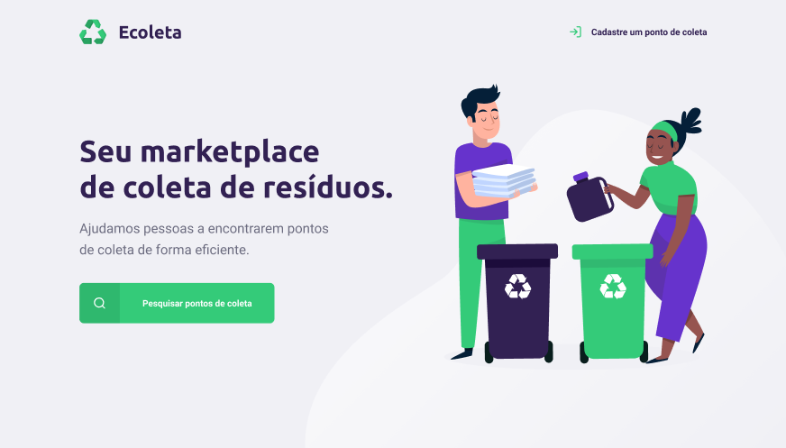

# rocketseat-NLW-1
\ (•◡•) / 1º next level week <a href="https://rocketseat.com.br/" target="_blank">:rocket:rocketseat</a> 

<h1 align="center">
    
    <br>
    Ecoleta
</h1>

<h4 align="center">
  O Ecoleta é um projeto para estudo da 1ª Next Level Week da Rocketseat, criado para gerenciar o processo de coleta de lixo nas cidades.</h4>
    
  ## :information_source: How To Use

To clone and run this application, you'll need [Git](https://git-scm.com), [Node.js v10.16][nodejs] or higher installed on your computer. From your command line:

Server:
```bash
# Clone this repository
$ git clone https://github.com/rafaelnc/rockeseat-NLW-1 ecoleta

# Go into the repository
$ cd ecoleta

# Go into the server
$ cd server

# Install dependencies
$ yarn install

# Run 
$ yarn run dev

# Execute migrations
$ yarn run knex:migrate
$ run knex:seed

```

Web:
```bash

# Go into the repository
$ cd ecoleta

# Go into the server
$ cd web

# Install dependencies
$ yarn install

# Run 
$ yarn start

```

Mobile:
```bash

# Go into the repository
$ cd ecoleta

# Go into the server
$ cd mobile

# Install dependencies
$ yarn install

# Run 
$ expo start

```
